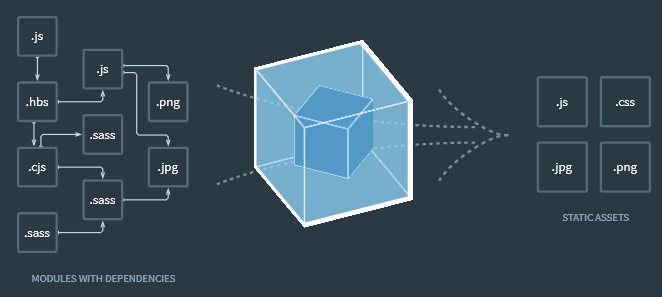

<br>
[Site Officiel](https://webpack.js.org/)

# Webpack

## Pourquoi webpack ? => manager ses assets

Webpack sert a "bundler" les assets, pour une meilleure gestion dans le projet de toutes les ressources et eviter les appels à des fichiers externes contenant des variables globales pouvant rentrer en conflit.<br>
Il peut gérer plusieurs types de fichiers et les convertir afin qu'ils soient compris par le navigateur<br>
Il est nécessaire d'avoir nodeJs d'installé et NPM

### Crétion d'un projet d'exemple
```bash
mkdir webpack-exemple && cd webpack-exemple && npm init -y && npm i webpack webpack-cli --save-dev

```

```/!\ changement de ``_dev`` en ``src`` pour ne pas compliquer tout de suite avec des entrées différentes. /!\```

### Import de fonction

Webpack nous permet de découper nos et de les importer à la maniere de Node. Ici le fichier math.js, qui comporte de simples fonctions d'addition et de multiplication, elles seront appelées dans ``index.js``.
```js
//fichier math.js
export const add = (a, b) => a + b;
export const mult = (a, b) => a * b;

//fichier index.js
import { add } from "./math";

const res = add(1, 2);
console.log(res);
```
Pour que webpack puisse faire son travail, il faut créer un script de "build".<br>
Dans ``package.json`` :
le nom de la commande build permettra a webpack d'aller chercher directement la commande dans le dossier ``.bin`` de ``node_module``
```json
"scripts": {
    "build": "webpack",
    "test": "echo \"Error: no test specified\" && exit 1"
  },
```
Dans le teminal :
```bash
npm run build
```
Il nous précisera que nous avons oublié de lui annoncer si nous sommes en mode developpement ou production.

Dans la console on constate le entry point ``main.js`` à lui même recours à ``math.js`` et qu'un bundle avec l'ensemble est créé dans un répertoire ``dist`` car nous sommes avec la config par défaut.

```bash
> webpack-exemple@1.0.0 build C:\Users\ronln\Desktop\webpack\webpack-exemple
> webpack

Hash: 69dda56df44d2491d7f9
Version: webpack 4.44.1
Time: 213ms
Built at: 2020-08-15 12:09:21
  Asset       Size  Chunks             Chunk Names
main.js  978 bytes       0  [emitted]  main
Entrypoint main = main.js
[0] ./src/index.js + 1 modules 149 bytes {0} [built]
    | ./src/index.js 74 bytes [built]
    | ./src/math.js 75 bytes [built]
```
Je rajoute ``--mode development`` à la commande ``build`` dans ``package.json``

```json
"scripts": {
    "build": "webpack --mode development"
  },
  ```
  Dans ce mode on ne voit plus l'arbre de dépendances et il n'y a plus de compression dans le fichier de résultat ``assets/main.js``<br>
  Modifier index.html :
  ```html
<body>
    <script src="../dist/main.js"></script>
</body>
  ```
  Et dans la console on peut observer la bonne interprétation de ``main.js`` :
```bash
3
```
Le bundler importe uniquement ce dont il a besoin, les fonction non appelées ne sont pas importées
exemple : 
```js 
export const mult = (a, b) => a * b;
```
n'est pas inteprétée.

## webpack-dev-server

Installer un serveur de dev sera plus facile pour la suite:

```bash
npm i webpack-dev-server
```
On rajoute à la partie script dans le ``index.json``
```json
"dev": "webpack-dev-server --mode development"
```
Lancer la commande 
```bash
npm run dev
```
Avec ``ctrl+clic`` on peut acceder directement au server et si on se rend a ``/src/`` on obtient le même résultat. Un petit gain de temps à l'ouverture du navigateur.

On peut désormais ajouter la commande dans ``package.json`` :
```json
"watch": "webpack --mode developement --watch"
```
Elle a pour but d'écouter tous les changements dans les fichiers pour une compilation automatique.

## Personnalisation de webpack

Pour sortir de la config par défaut, il faut créer un fichier à la racine un fichier ``webpack.config.js``
<br>
```bash
/!\ A partir de ce point toutes les infos seront détailées dans webpack.config.js - seule la logique de compréhension sera dans le cours.md/!\
```
```js
// import node native package
const path = require('path');

module.exports = {
    //starting point for bundling
    entry: './src/index.js',
    //ending point after compiling
    //value is an object with 2 properties
    output: {
        //path (package natively given by node for an absolute path) 
        path: path.resolve(__dirname, 'dist'),
        //change the bundle filename
        filename: 'bundle.js'

    }
}
```
Penser à mofifier le fichier de pointage dans ``index.html``

## Les loaders
Webpack par défaut ne comprend que le javascript et le json, il faut lui indiquer quel loader va transformer quel fichiers. Il va tester l'extension du fichier à l'aide d'expressions régulières et trouver le loader correspondant pour l'interpréter et l'intégrer a son bundle.
On va transpiler de es6 vers es5 pour exemple.
creer un fichier ``.babelrc`` qui contient un objet ``.json`` qui comporte la propriété presets dont la valeur est un tableau est on indique les presets utlisés.
<br>
Qaund on ajoute dans ``index.js`` (pour rappel fichier où l'on importe tout ce qui doit passer par ``webpack.config.js``), on remarque que webpack ne comprends pas autre chose que le ``.js``.
```js
//index.js
import './app';
```
la console affiche :
```bash
$ npm run build

> webpack-exemple@1.0.0 build C:\Users\ronln\Desktop\webpack\webpack-exemple
> webpack --mode development

Hash: 2b16358a3df90b689106
Version: webpack 4.44.1
Time: 579ms
Built at: 2020-08-15 14:56:26
    Asset      Size  Chunks             Chunk Names
bundle.js  4.84 KiB    main  [emitted]  main
Entrypoint main = bundle.js
[./src/index.js] 84 bytes {main} [built]
[./src/math.js] 122 bytes {main} [built]

ERROR in ./src/index.js
Module not found: Error: Can't resolve './app' in 'C:\Users\ronln\Desktop\webpack\webpack-exemple\src'
 @ ./src/index.js 2:0-15
npm ERR! code ELIFECYCLE
npm ERR! errno 2
npm ERR! webpack-exemple@1.0.0 build: `webpack --mode development`
npm ERR! Exit status 2
npm ERR!
npm ERR! Failed at the webpack-exemple@1.0.0 build script.
npm ERR! This is probably not a problem with npm. There is likely additional logging output above.

npm ERR! A complete log of this run can be found in:
npm ERR!     C:\Users\ronln\AppData\Roaming\npm-cache\_logs\2020-08-15T12_56_26_172Z-debug.log
```
Il faut faire entrer en action un nouveau loader qui sera capable de gérer les fichiers ``.css``<br>

## les plugins

La différence entre les loaders et les plugins:
- loaders s'appliquent fichier par fichier (il teste fichier/fichier et si ok il transforme)
- plugin s'execute au niveau du package et du bundle (ex: plug-in de minification)

il faut require le plug-in pour l'utiliser, puis créer une instance.<br>
dans l'objet module de ``webpack.config.js``<br>
En exemple on utilisera entre autre le pogressPlugin 8:28

## plug-in externe

```bash 
npm i --save-dev html-webpack-plugin
```

``HtmlWebpackPlugin`` est utilisé pour injecter le script js principal dans le dom.

## Plusieurs bundles en fonction des pages

On peut créer un objet pour les entrées afin d'avoir un script différent par page.
Il faut dans ce cas un objet HtmlWepackPlugin par page :
```js
new HtmlWebpackPlugin({
    //optional: hash for cache inconvenient in dev mode
    hash: true,
    //optional: init varariable title (add a var and using it in html)
    title: 'Webpack 4',
    //use template
    template: './src/index.html'
}),
new HtmlWebpackPlugin({
    //optional: hash for cache inconvenient in dev mode
    hash: true,
    //optional: init varariable title (add a var and using it in html)
    title: "technos",
    // to target the script
    chunks: ['technos'],
    filename: 'technos.html'
}),
```

## webpack-analyser-plugin

Afin d'eviter les multiples appels à des librairies utilisées et chargées par plusieurs packages il faut installer ce plug-in. Webpack optimisera les appels.

```bash
npm i -D webpack-bundle-analyzer
```
Une fenêtre se chargera de montrer les différents appels.
<br>
Il faut ensuite utiliser ``splitChunks`` et lui indiquer cette série de propriétés:
```js
 optimization: {
        splitChunks: {
            cacheGroups: {
                node_vendors: {
                    test: /[\\/]node_modules[\\/]/,
                    //static & dynamic imports
                    chunks: "all",
                    priority: 1
                },
            },
        },
    },
```
Se référer à la [documentation](https://webpack.js.org/plugins/split-chunks-plugin/) pour en savoir plus 


